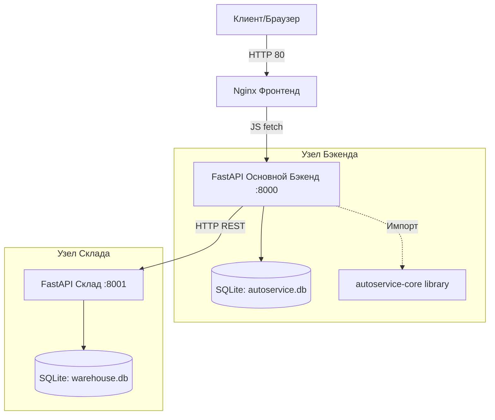

# Архитектура проекта AutoService

Проект построен по микросервисной архитектуре с вынесением общей бизнес-логики в отдельную библиотеку.

## C4 Model (Component Level)

## Паттерны проектирования
1. **Backend-for-Frontend / Partial Gateway**: клиентский JS ходит в основной backend, а доступ к складу для UI организован через прокси-маршруты `/api/warehouse/*`.
2. **Shared Library**: пакет `autoservice_core` хранит общие доменные модели, расчёт стоимости деталей и расчёт бонусов сотрудников.
