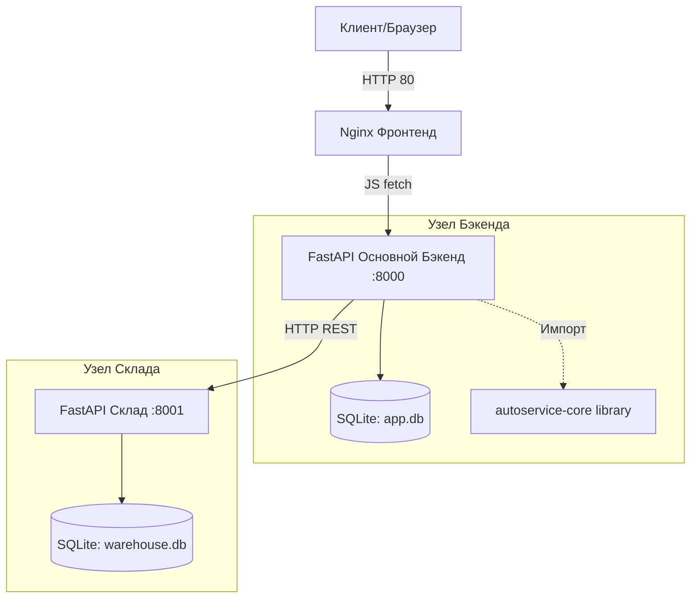

# Архитектура проекта AutoService

Проект построен по микросервисной архитектуре с вынесением общей бизнес-логики в отдельную библиотеку.

## C4 Model (Component Level)

## Паттерны проектирования
1. **API Gateway (Частично)**: Роль маршрутизации запросов к сервисам берет на себя клиент (JS), но запросы к складу проксируются через основной Backend.
2. **Shared Library**: Пакет `autoservice_core` используется для разделения чистой бизнес-логики (расчет стоимости заказов) от транспортного слоя (FastAPI).
